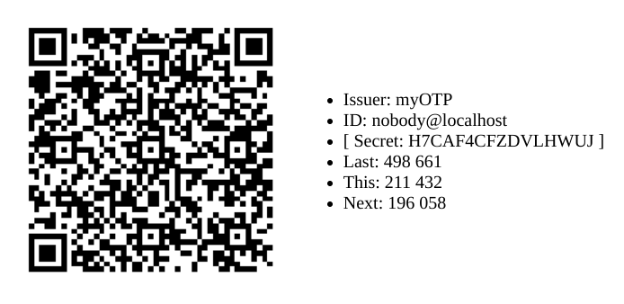

# otp

## Overview

This package provides a Google Authenticator compatible One Time Pad
(otp) implementation.

Automated documentation for this Go package is available from
[](https://pkg.go.dev/zappem.net/pub/auth/otp).

While the `otp` package has no dependencies beyond the standard Go
packages, we include an example binary, `example/main.go`, that serves
as a demonstration of using the package and includes the generation of
a QR code for enrolling a sample OTP config to the Google
Authenticator application. This generation uses the
[`github.com/skip2/go-qrcode`](https://pkg.go.dev/github.com/skip2/go-qrcode)
package.

To try this example:
```
$ go mod tidy
$ go build example/main.go
$ ./main
```

This will start a webserver listening to
[localhost:8080](http://localhost:8080). The program generates a
random new OTP secret each time it is invoked, and there is no lasting
value to the generated key. But the compatibility with Google
Authenticator can be validated using it. An example output looks like
this:



The webserver:

- shows an enrollment QR code for the stated *secret*. In a real
  application, you would not normally show the 16 character base32
  encoded secret like this. However, this secret or a copy of the QR
  code can be used to backup your OTP setup. The QR code and the
  secret will remain constant until you restart the `main`
  program. That is, the QR code doesn't change if you refresh the
  page.

- shows three OTP codes one for each of the 30 seconds prior to,
  including, and just after the current time. If you refresh the page,
  these three codes may change if sufficient time has passed. If you
  import the QR code into Google Authenticator, you will see the OTP
  code for "myOTP: nobody@localhost" match one of these three
  codes. Which code depends on the time skew between your computer at
  the time you rendered the page and the time on your phone. If it
  takes a while to set things up, you may need to refresh the page to
  view a recent enough code.

- given the way this OTP mechanism works, you can set up the same
  configuration on multiple phones and they will all generate the same
  OTP code sequences at the same times.

## License info

The `otp` package is distributed with the same BSD 3-clause license
as that used by [golang](https://golang.org/LICENSE) itself.

## Reporting bugs and feature requests

Use the [github `otp` bug
tracker](https://github.com/tinkerator/otp/issues).
